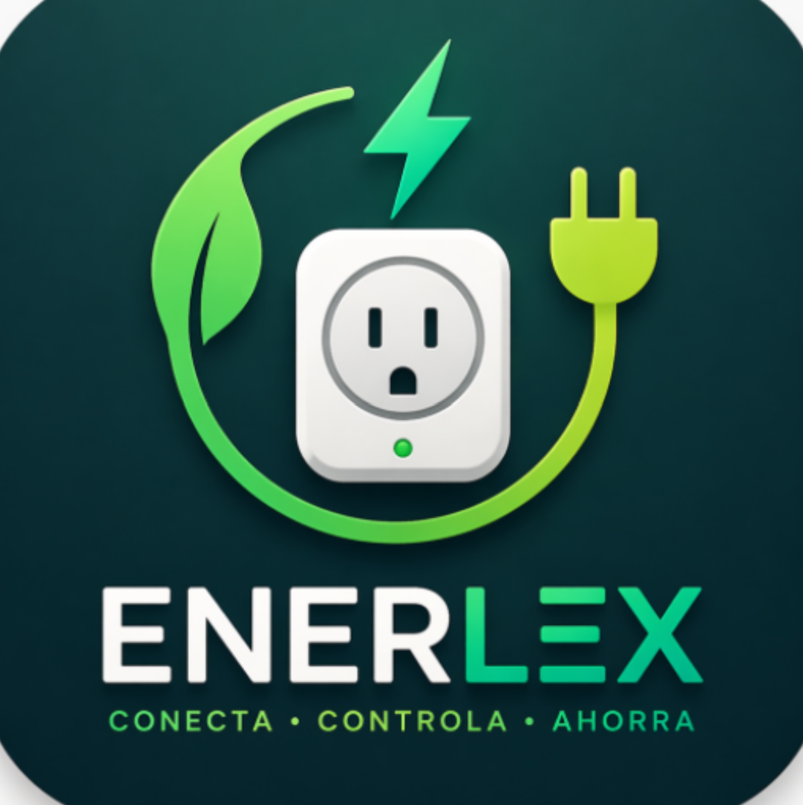

# 👨‍💻 Juan Diego Pardo Ballesteros — Portafolio

> Portafolio web personal de **Juan Diego Pardo Ballesteros**, Ingeniero de Sistemas.  
> Diseño oscuro, interactivo y completamente responsivo.

[](https://www.linkedin.com/in/juan-diego-pardo-ballesteros-b96a4b2b9)
[](https://github.com/Pardo250)
[](mailto:juandiegopardo05@gmail.com)

---

## 🛠️ Skills

### 💻 Lenguajes de programación

[](https://skillicons.dev)

### 🚀 Frameworks & Librerías

[](https://skillicons.dev)

### 🗄️ Bases de datos

[](https://skillicons.dev)


### ⚙️ DevOps & Infraestructura

[](https://skillicons.dev)

### 🔧 Herramientas

[](https://skillicons.dev)

### 📚 Conocimientos adicionales


---

## 📱 Proyectos

### ⚡ Enerlex



> App móvil que conecta a toma corrientes inteligentes para encender o apagar dispositivos y ahorrar energía.

[](https://flutter.dev)
[](https://supabase.com)

🔗 [Ver repositorio](https://github.com/Enerlex-Project/Enerlex-flutter)

---

### 🦅 CondorApp


> Red social de viajes: crea reseñas, explora destinos turísticos, publica fotos, sigue usuarios y visualiza tu ubicación en un mapa interactivo.

[](https://kotlinlang.org)
[](https://firebase.google.com)
[](https://nodejs.org)
[](https://expressjs.com)

🔗 [Ver repositorio](https://github.com/Movil-Condorapp/Movil)

---

## 🎨 Stack del portafolio

[](https://skillicons.dev)

| Tecnología | Uso |
|---|---|
| React 19 + TypeScript | Framework principal |
| Vite 8 | Bundler y servidor de desarrollo |
| Tailwind CSS v4 | Estilos utility-first |
| Framer Motion | Animaciones y transiciones |
| react-type-animation | Efecto typewriter en el Hero |
| react-scroll | Smooth scroll entre secciones |
| react-icons | Íconos de tecnologías |
| @emailjs/browser | Formulario de contacto sin backend |

---

## 🗂️ Estructura del proyecto

```
src/
├── components/
│   ├── Navbar.tsx
│   ├── sections/
│   │   ├── Hero.tsx
│   │   ├── About.tsx
│   │   ├── Skills.tsx
│   │   ├── Projects.tsx
│   │   └── Contact.tsx
│   └── ui/
│       ├── SectionTitle.tsx
│       ├── SkillBadge.tsx
│       └── ProjectCard.tsx
├── data/
│   ├── skills.ts
│   └── projects.ts
├── hooks/
│   └── useActiveSection.ts
├── App.tsx
└── index.css
public/
└── Projects/
    ├── enerlex/logo.png
    └── condorapp/logo.png
```

---

## 🚀 Correr localmente

```bash
# Instalar dependencias
npm install

# Servidor de desarrollo
npm run dev

# Build de producción
npm run build
```

Abre `http://localhost:5173` en el navegador.
